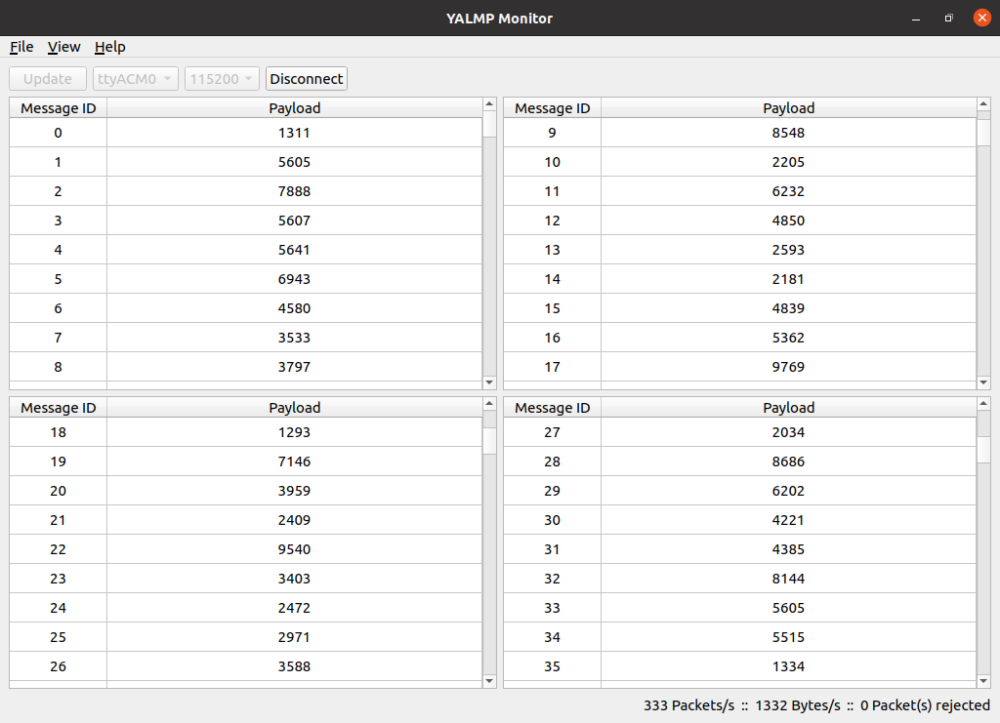

# YALMP Monitor

[YALMP](https://github.com/pabloelices/yalmp "YALMP") real-time viewer.



**Note**: This repository if part of my final year project and is by no means production ready.

## 1. Usage

Download an [AppImage](https://appimage.org/ "appimage.org") from the [releases](https://github.com/pabloelices/yalmp-monitor/releases "Releases") page and make it executable. Make sure you have access to serial ports:

```
# Debian / Ubuntu.

sudo usermod -a -G dialout <user>

# Arch / Manjaro.

sudo usermod -a -G uucp <user>
```

## 2. License

GNU General Public License v3.0. See [LICENSE](LICENSE "LICENSE") for details.
